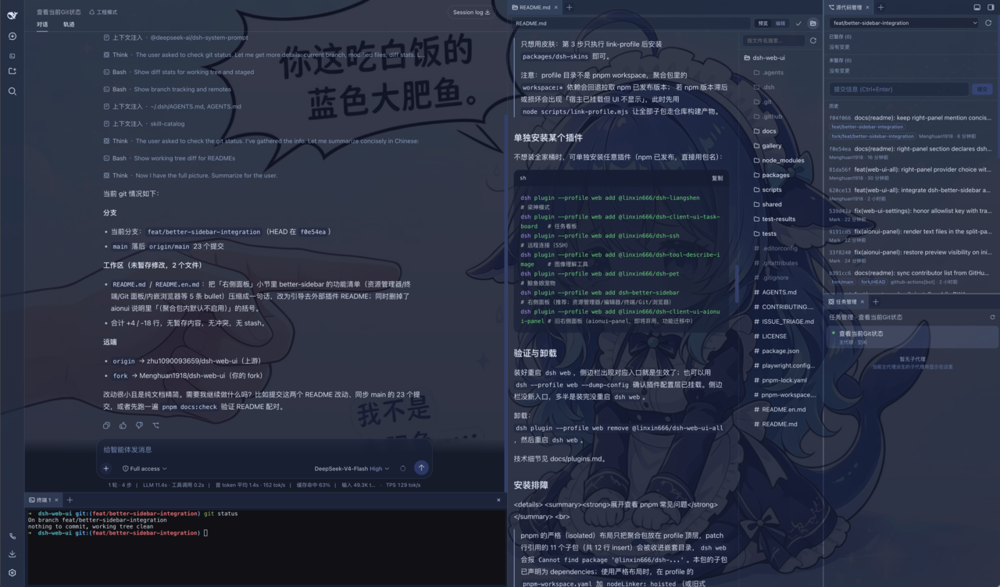
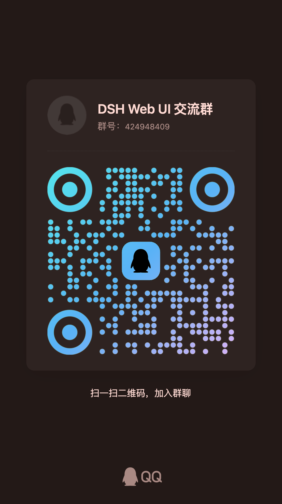

# dsh-web-ui · DSH Web UI

[中文](README.md) | English

<p align="center">
  
</p>

<p align="center">
  
  &nbsp;
  
  &nbsp;
  
  &nbsp;
  
</p>

<p align="center">
  <strong>The plugin and skin family for the DeepSeek Harness (DSH) Web GUI</strong><br>
  <em>Task board · Git graph · Right panel · Mobile remote · SSH ops · Image understanding · Whale-girl pet · Live usage · Skin center</em>
</p>

<p align="center">

[What It Is](#what-it-is) · [Feature Plugins](#feature-plugins) · [Skins](#skins) · [Quick Start](#quick-start) · [FAQ](#faq) · [Known Limitations](#known-limitations) · [Community](#community)

</p>

## What It Is

dsh-web-ui is a collection of plugins and skins for the DeepSeek Harness (DSH) Web GUI. Every plugin mounts into `dsh web` through the official profile mechanism without touching the DSH source; install plugins individually, or everything at once through the aggregate package.


| Capability | Stock dsh web | dsh-web-ui family |
| --- | --- | --- |
| Task board | None | Multi-column board + cron-scheduled real runs |
| Git visualization | None | Branch lanes + commit history graph |
| File preview & changes | None | Right panel: preview / file tree / SCM |
| Mobile remote control | None | QR pairing with SSE real-time sync |
| Remote server ops | None | SSH panel: terminal / transfer / tunnels / cluster |
| Image understanding | None | `describe_image` vision tool |
| Themes & skins | Default theme | Skin center with 10 skins, try-on before apply |
| Usage stats | None | Live TPS / tokens / cache hit rate |

## Feature Plugins

### Task Board

Open it from the sidebar. Tasks are organized into five columns: Planned, To-do, In Progress, Done, and Failed. Clicking "Run" on a card hands the task to a real DSH agent session; when it finishes, the card status updates automatically. To review what happened, jump directly into the execution session for the full transcript.

Tasks also support scheduled execution: configure a cron expression in the detail view (e.g. auto-upgrade DSH at 23:00 daily, generate a weekly report at 09:00 every Monday), and the task runs on its own at the scheduled time.

| Multi-column board | Scheduled execution |
| --- | --- |
|  |  |

### Git Graph

The branch picker above the input box handles branch switching and commit history browsing; the Git graph visualizes branch lanes and commit history, making it easy to trace changes along the timeline even in large repositories.


### Right Panel

When a project session is open, two panels appear to the right of the chat area — "Preview" and "Files/Changes":

- **File tree**: browse the working directory; click a file to open it in the preview panel, click a folder row to expand it, and search for files by name;
- **Preview**: multi-tab preview for markdown, HTML, code, diff, CSV, PDF, Office, images and plain text, with source/preview switching, split-screen editing and saving;
- **Changes (SCM)**: a real git changes panel with stage / unstage / discard;
- Panel widths are draggable (double-click a handle to reset), and the collapsed state plus widths persist per project;
- All ten skins adapt the right panel — switching skins restyles the panels to match the theme.



### Whale-Girl Pet

A whale girl who lives at the edge of the interface and switches animations with the agent's state: thinking, waiting, working, celebrating. Click her to interact (pet her head), feed her dried fish to raise affinity, and grow her from a baby whale to "deep-sea bond". She can be renamed, dragged to any position, or hidden whenever you want.

| Working companion | Interaction panel |
| --- | --- |
|  |  |

### Live Token Stats

Real-time usage shown directly below the input box: generation speed (TPS), LLM time, context usage, cache hit rate, and input / output token counts — the cost of every generation stays visible at a glance.


### Mobile Remote Control

The phone icon at the bottom of the sidebar opens the pairing panel: scan the QR code (or copy the link) to pair, and the phone lands on a standalone mobile surface that remote-controls the current dsh web workspace — browse and create sessions, send and receive messages, switch models and reasoning effort, and adjust the permission preset, all in sync with the desktop. Pairing tokens are one-time and time-limited; "Stop" revokes every paired device at any time. The QR defaults to the LAN, or turn on the cloudflared public tunnel so the phone can pair from any network.

> **Real-time messages and tunnels**: the mobile surface relies on SSE (Server-Sent Events) for live messages. Cloudflare quick tunnels (trycloudflare.com) and Tailscale Serve do not pass SSE through — plain HTTP works, live push does not reach the phone. In that case the plugin falls back to polling: messages still flow, only new messages may arrive a few seconds late. For instant push, use an SSE-capable tunnel (Cloudflare named tunnel, custom TCP port forwarding, etc.).

| Workspaces | Sessions & new session |
| --- | --- |
|  |  |
| Chat (folded reasoning & tool calls) | Model & reasoning-effort picker |
|  |  |

### Remote Connection

The "SSH" sidebar entry opens the remote-ops panel. Hosts support key / password auth and one-click import from `~/.ssh/config`; config lives in `~/.dsh/dsh-ssh.json`. Real operations on configured hosts:

- **Web terminal**: xterm.js PTY with live output and auto-fit;
- **File transfer**: SFTP upload / download with progress and a remote directory browser;
- **Port forwarding**: local tunnels to remote internal services (databases, APIs, admin consoles), bound to 127.0.0.1 only;
- **Cluster runs**: one command across many hosts concurrently, filtered by alias / environment / tags;
- **Agent direct control**: agents share the same host config — just say "check xxx" in chat and the agent runs remote commands for you.

### Image Understanding

Gives text-only models vision: when a conversation mentions an image (local path, http(s) URL, or session attachment), the `describe_image` tool sends it to a configured OpenAI-compatible vision endpoint (Qwen-VL, GLM-4V, GPT-4o, a local Ollama endpoint…) and returns the answer. **Only the returned text enters the conversation — the image itself never enters the session log.** Since text-only models have no image entry in the input box, the plugin adds an image button there: picking a file inserts an attachment reference into your draft, and the model can analyze it via `describe_image`; the tool also accepts a `prompt` argument for precise custom instructions (OCR, UI diagnosis, translation) that beat a generic description. Endpoint, model, key, and the default instruction are configured live under Settings > Plugin config > "Image understanding".

### Settings Hub

All family plugins' toggles and parameters live under "Settings > Plugin config", and changes apply immediately; a "Community plugins" card inside the group indexes plugins registered by community contributors and links to their repositories.


## Skins

The skin center ships ten skins, each supporting try-on before applying: preview applies instantly and reverts fully on exit; once you are satisfied, apply it with one click.


### Windows XP (Luna)

A faithful recreation of the classic Luna interface: blue gradient window chrome, a green Start button, the Bliss blue-sky desktop, and square corners throughout.


### Blue Fantasy

Whale artwork lies beneath translucent panes, wrapped in a periwinkle-indigo palette — particularly striking in dark mode.


### Whale Song

The deep-sea whale-goddess theme: a text-free ambience painting (a blue-haired goddess with a whale pod on the left, an ice-blue constellation grid with gold-thread accents, and generous open water on the right) sits beneath translucent panes, wrapped in an ice-blue / cyan / navy / cobalt palette — with a night-cruise dark variant.

 · 

### Harbor

A dusk-harbor theme: the anime-girl harbor painting (a twilight-blue sky melting into sunset orange) sits beneath translucent panes, wrapped in a deep-navy base with amber-orange accents — a thin twilight scrim in light mode and a deeper dusk veil in dark mode.

 · 

## Quick Start

### System Requirements

- DeepSeek Harness installed, with `dsh web` starting normally.
- npm installs need nothing extra; repository installs need Node.js >= 22 and pnpm.

### Get Started in 3 Steps

1. Install the aggregate package: `dsh plugin --profile web add @linxin666/dsh-web-ui-all`
2. Restart `dsh web` — every plugin entry appears in the sidebar
3. Open "Settings > Plugin config" to toggle plugins, or try on skins in the skin center

### Install from npm (Recommended)

The plugins are published to npm (the `@linxin666` scope) — one command installs everything:

```sh
dsh plugin --profile web add @linxin666/dsh-web-ui-all
```

Restart `dsh web` and all plugin entries appear in the sidebar. Skins only? Install `@linxin666/dsh-skins` instead.

### Install from the GitHub Repository (Development)

The packages are already on npm; installing from this repository is only for development (requires Node.js >= 22 and pnpm):

```sh
# 1. Clone the repository
git clone https://github.com/zhu1090093659/dsh-web-ui.git
cd dsh-web-ui

# 2. Install dependencies and build
pnpm install
pnpm -r build

# 3. Link the family into the web profile (recommended: link all children first, then the aggregate)
node scripts/link-profile.mjs
dsh plugin --profile web add link:$(pwd)/packages/dsh-web-ui-all

# 4. Restart dsh web — all plugin entries appear in the sidebar
dsh web
```

> Skins only? Run only link-profile in step 3, then install `packages/dsh-skins`.
>
> Note: the profile directory is not a pnpm workspace, so `workspace:*` dependencies in the aggregate package
> fall back to the published npm versions; if the npm versions lag or break you may see "host mounted but UI
> missing" — in that case run `node scripts/link-profile.mjs` first so every child package uses the
> repository build output.

### Install a Single Plugin

Prefer individual plugins? Install them one by one (published on npm, so use the package name directly):

```sh
dsh plugin --profile web add @linxin666/dsh-client-ui-task-board   # Task board
dsh plugin --profile web add @linxin666/dsh-ssh                    # Remote connection (SSH)
dsh plugin --profile web add @linxin666/dsh-tool-describe-image    # Image understanding tool
dsh plugin --profile web add @linxin666/dsh-pet                    # Whale-girl pet
```

### Verify and Uninstall

After installing, restart `dsh web` — a working plugin shows up in the sidebar. You can also confirm the mounted config layers with `dsh --profile web --dump-config`. If nothing appears in the sidebar, you most likely forgot to restart `dsh web`.

Uninstall: `dsh plugin --profile web remove @linxin666/dsh-web-ui-all`, then restart `dsh web`.

Technical details live in [docs/plugins.md](docs/plugins.md).

### Install Troubleshooting

<details>
<summary><strong>Expand for common pnpm issues</strong></summary>

<br>

> pnpm's strict (isolated) layout only puts the aggregate package at the profile top level, so the 11 child packages referenced by the patch rows (12 insert rows) stay nested and `dsh web` fails with `Cannot find package '@linxin666/dsh-...'`. The children are declared as dependencies of this package; on a strict layout, add `nodeLinker: hoisted` (or the legacy `public-hoist-pattern: ['@linxin666/*']`) to the profile's `pnpm-workspace.yaml` and reinstall.

> First install may stop on `ERR_PNPM_IGNORED_BUILDS` (pnpm blocks dependency build scripts): copy the printed keys (`cloudflared` / `cpu-features` / `ssh2`) into the profile's `pnpm-workspace.yaml` `allowBuilds` list and re-run.

> **pnpm 11 release-age gate**: for about 10 days after a new release, pnpm 11's `minimumReleaseAge` gate can silently resolve to older `@linxin666/*` versions (e.g. `dsh-web-ui-all@0.1.5` with the old skin center). The old skin center writes references to standalone skin packages when a skin is applied, which crashes `dsh web` at boot (`ERR_MODULE_NOT_FOUND ... dsh-client-ui-skin-*`). Exclude every `@linxin666/*` package in the profile's `pnpm-workspace.yaml` before installing or updating:
>
> ```yaml
> minimumReleaseAgeExclude:
>   - '@linxin666/*'
> ```

</details>

## FAQ

<details>
<summary><strong>I restarted, but nothing appears in the sidebar?</strong></summary>

A: First confirm the plugin went into the `web` profile (the `--profile web` in the command), then check the mounted config layers with `dsh --profile web --dump-config`; if it still fails, see "Install Troubleshooting" above. Note that a page refresh is not enough — the `dsh web` process must be restarted.

</details>

<details>
<summary><strong>Why didn't a scheduled task run on time?</strong></summary>

A: Scheduling happens in the browser, so the `dsh web` tab must stay open; triggers missed while the tab is closed are skipped, not queued. A task that is already running at the trigger time is also deferred to the next matching point.

</details>

<details>
<summary><strong>The phone pairs but gets no live messages?</strong></summary>

A: Cloudflare quick tunnels and Tailscale Serve do not pass SSE through. In that case the plugin falls back to polling — messages still flow, new ones may lag a few seconds. For instant push, use an SSE-capable tunnel (Cloudflare named tunnel, custom TCP port forwarding, etc.).

</details>

<details>
<summary><strong>I tried a skin and don't like it — what now?</strong></summary>

A: Skins support try-on before applying: the preview applies instantly and reverts fully on exit, and nothing persists until you click "Apply", so feel free to experiment.

</details>

<details>
<summary><strong>I only want the skins, or just one plugin?</strong></summary>

A: Install `@linxin666/dsh-skins` for skins only, or use the package names under "Install a Single Plugin" — both work with the npm install flow.

</details>

## Known Limitations

- Task-board scheduling is browser-side: the `dsh web` tab must stay open, and triggers missed while it is closed are skipped, not queued — see [dsh-task-board README](packages/dsh-task-board/README.md).
- SSH passwords and passphrases are stored in plaintext in `~/.dsh/dsh-ssh.json` (mode 0600); reconnects may replay non-idempotent commands, and remote output is returned unredacted — see the security model in [dsh-ssh README](packages/dsh-ssh/README.md).
- Mobile remote relies on SSE live push: Cloudflare quick tunnels and Tailscale Serve do not pass SSE through, so the plugin falls back to polling and new messages may arrive a few seconds late.
- Repository installs require Node.js >= 22 and pnpm and are for development only; npm installs are unaffected.

## Community

Join the community center to talk with the developers and other users — share tips, report issues, discuss ideas. Scan the WeChat QR code:



You can also join the [Discord community](https://discord.gg/6v4gm9u4S), or head straight to [GitHub Issues](https://github.com/zhu1090093659/dsh-web-ui/issues) to report bugs / request features.

<details>
<summary>Friend links</summary>

- [DeepSeek Harness Desktop](https://github.com/anywhere-labs/deepseek-harness-desktop) — a modern desktop experience built for the DeepSeek Harness (DSH) ecosystem.
- [LINUX DO](https://linux.do) — a new ideal community.
- [dshfind](https://dshfind.com) — a learning and sharing community for DeepSeek Harness, aggregating paper deep-dives, a plugin marketplace and user rankings.
- [deepseek-plugin-store](https://github.com/Ericwong5021/deepseek-plugin-store) — an independent community plugin store for DeepSeek Harness: discover, install and submit verified plugins, tools and extensions.
- [dsh-data-agent](https://github.com/omdsh-dev/dsh-data-agent) — a dedicated Data Agent preset for DSH that lets AI query, update and analyze your data.
- [dsh-TUI](https://github.com/ccch1mneyyy/dsh-TUI) — a Claude Code style full-screen terminal plugin filling the official terminal TUI gap: pixel whale header, live status line, streamed reasoning, double-Esc rollback, context progress and a TPS gauge.
- [dsh-tianshu-tui](https://github.com/huiliyi37/dsh-tianshu-tui) — an interactive terminal UI plugin built on the official DeepSeek Harness, adding TDD and evidence gates on top.

</details>

## Contributing

- Read [CONTRIBUTING.md](CONTRIBUTING.md) before opening a PR; attach screenshots or verification evidence for user-visible changes.
- Commit messages follow Conventional Commits (e.g. `fix(task-board): fix xxx`); emoji is banned in code, docs and commit messages alike.
- Scaffold new plugins and skins with `node scripts/dsh-plugin-new <name>` and `node scripts/dsh-skin-new`.
- Pass the gates before submitting — `pnpm typecheck && pnpm test && pnpm docs:check`; the full workflow lives in [docs/development.md](docs/development.md).

## License

This repository is licensed under [Apache-2.0](LICENSE). Third-party code merged in must keep its LICENSE and attribution; active third parties with an upstream are forked or referenced as dependencies instead of vendored.

### Sources & Licensing

| Package | Origin | License |
| --- | --- | --- |
| dsh-task-board / dsh-git-graph / dsh-aionui-panel / dsh-pet / dsh-remote-web-ui / dsh-live-stats / dsh-web-ui-settings / dsh-liangshen / dsh-skins / dsh-web-ui-all / skins | Authored by zhu1090093659 | Apache-2.0 (zhu1090093659) |
| dsh-tool-describe-image | Ported from [whitelonng/dsh-plugin-describe-image](https://github.com/whitelonng/dsh-plugin-describe-image) (deepseek-harness `packages/vision/tool-describe-image`) | Apache-2.0 (zhu1090093659) |

## Contributors

<p align="center">
  <a href="https://github.com/zhu1090093659/dsh-web-ui/graphs/contributors">
    
  </a>
</p>

## Star History

<p align="center">
  <a href="https://www.star-history.com/?repos=zhu1090093659%2Fdsh-web-ui&type=date&legend=top-left">
    
  </a>
</p>

<div align="center">

**If you like it, give us a star.**

[Report Bug](https://github.com/zhu1090093659/dsh-web-ui/issues) · [Request Feature](https://github.com/zhu1090093659/dsh-web-ui/issues) · [View Releases](https://github.com/zhu1090093659/dsh-web-ui/releases)

</div>
